<div align="center">


# PharmaLove Suite

**Integrated Pharmacy Management System**


</div>

> **Hero view — point of sale**
>
> [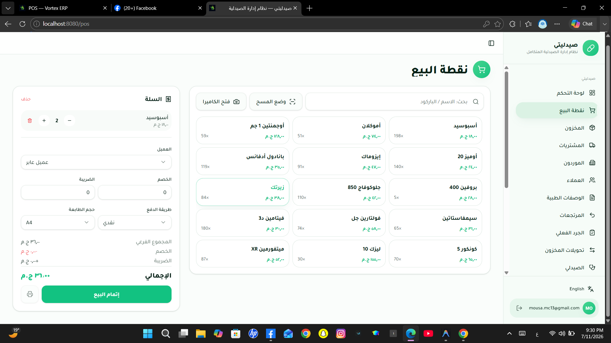](screenshots/005-pharmalove-ui.png)
>
> A bilingual checkout workspace that brings product search, cart handling, customer selection, payment, and printing controls together.

---

## Table of Contents | فهرس المحتويات

- [Overview](#overview--نظرة-عامة)
- [Quick Start](#quick-start--بدء-سريع)
- [Quick Facts](#quick-facts--حقائق-سريعة)
- [Why This Project?](#why-this-project--لماذا-هذا-المشروع)
- [System Scope](#system-scope--نطاق-النظام)
- [Screenshots](#screenshots--لقطات-الشاشة)
- [Key Features](#key-features--الميزات-الرئيسية)
- [Module Overview](#module-overview--نظرة-عامة-على-الوحدات)
- [System Workflow](#system-workflow--سير-العمل)
- [Engineering Highlights](#engineering-highlights--نقاط-الإبداع-والتميز)
- [Technology Stack](#technology-stack)
- [Architecture Overview](#architecture-overview--نظرة-عامة-على-المعمارية)
- [Engineering Decisions](#engineering-decisions--قرارات-هندسية)
- [Performance Considerations](#performance-considerations--اعتبارات-الأداء)
- [Technical Challenges](#technical-challenges--التحديات-التقنية)
- [UI/UX Design](#uiux-design--تصميم-واجهة-المستخدم)
- [Installation & Configuration](#installation--configuration--التثبيت-والإعداد)
- [Project Structure](#project-structure--هيكل-المشروع)
- [Services Provided](#services-provided--الخدمات-المقدمة)
- [API Overview](#api-overview)
- [Database Overview](#database-overview--نظرة-عامة-على-قاعدة-البيانات)
- [Security](#security--الأمان)
- [Deployment](#deployment--النشر)
- [Roadmap](#roadmap--خارطة-الطريق)
- [Development Team](#development-team)

---

## Overview | نظرة عامة

🇺🇸 **English**

PharmaLove Suite is a web-based pharmacy management system for pharmacists and pharmacy staff. It unifies point-of-sale activity, medicine inventory and batches, purchasing, prescriptions, clinical tools, finance, and operational reporting in one authenticated workspace. The system is designed to help daily pharmacy work remain traceable across stock, sales, suppliers, and patient-facing prescription workflows.

🇸🇦 **العربية**

PharmaLove Suite هو نظام ويب لإدارة الصيدليات موجّه للصيادلة وطاقم الصيدلية. يوحّد عمليات نقطة البيع ومخزون الأدوية والتشغيلات والمشتريات والوصفات والأدوات السريرية والمالية والتقارير التشغيلية في مساحة عمل واحدة موثّقة. يساعد النظام على إبقاء العمل اليومي قابلاً للتتبع عبر المخزون والمبيعات والموردين ومسارات الوصفات المرتبطة بالمرضى.

## Quick Start | بدء سريع

🇺🇸 **English**

The application uses npm scripts and requires Supabase credentials before it can access the data layer. See [Installation & Configuration](#installation--configuration--التثبيت-والإعداد) for the complete environment setup.

🇸🇦 **العربية**

يستخدم التطبيق أوامر npm ويتطلب بيانات اعتماد Supabase قبل الاتصال بطبقة البيانات. راجع [التثبيت والإعداد](#installation--configuration--التثبيت-والإعداد) للإعداد الكامل للبيئة.

```bash
git clone https://github.com/mosaa65/PharmaHub-suite.git
cd PharmaHub-suite
npm install
# Configure the required Supabase variables before starting the application.
npm run dev
```

## Quick Facts | حقائق سريعة

| Item | Value |
| --- | --- |
| Project type | Web-based pharmacy management system |
| Architecture | TanStack Start application with Supabase-backed PostgreSQL data access |
| Frontend | React, TypeScript, TanStack Start/Router, Tailwind CSS |
| Backend | TanStack Start server functions and Supabase Auth/Data APIs |
| Database | PostgreSQL via Supabase |
| Deployment | `[PROJECT_LIVE_URL — not specified in repository]` |
| License | Not specified in the repository |

---

## Why This Project? | لماذا هذا المشروع؟

🇺🇸 **English**

Pharmacy operations connect clinical and commercial decisions: dispensing affects batches and stock, a sale can include insurance data, and a prescription must retain its patient and item history. PharmaLove Suite places those linked workflows in one system instead of separating the counter, stock records, purchasing, and clinical review into disconnected tools. This approach benefits pharmacy teams that need a current operational view while retaining dedicated prescription and batch records.

🇸🇦 **العربية**

تربط عمليات الصيدلية بين القرارات السريرية والتجارية؛ فالصرف يؤثر في التشغيلات والمخزون، وقد تتضمن عملية البيع بيانات تأمين، وتحتاج الوصفة إلى حفظ تاريخ المريض وبنودها. يضع PharmaLove Suite هذه المسارات المترابطة في نظام واحد بدلاً من فصل الكاونتر وسجلات المخزون والمشتريات والمراجعة السريرية في أدوات متباعدة. يفيد هذا النهج فرق الصيدليات التي تحتاج إلى رؤية تشغيلية حديثة مع الاحتفاظ بسجلات مخصصة للوصفات والتشغيلات.

## System Scope | نطاق النظام

🇺🇸 **English**

- **Dispensing and commerce:** point of sale, receipt printing, sales history, insurance amounts, returns, and customer loyalty points.
- **Inventory and supply:** products, barcodes, batches, expiry dates, stock takes, warehouses, transfers, suppliers, and purchase orders.
- **Clinical workflows:** customer allergies, prescriptions and prescription items, chronic refill dates, interaction review, dose advice, and guided triage.
- **Finance and insight:** sales, purchase, product, supplier-balance, insurance-claim, and trend views; export and backup functions.
- **Administration:** authenticated access, admin/pharmacist/cashier roles, pharmacy settings, staff, Arabic/English presentation, and audit records.

🇸🇦 **العربية**

- **الصرف والتجارة:** نقطة البيع وطباعة الإيصالات وسجل المبيعات والتأمين والمرتجعات ونقاط ولاء العملاء.
- **المخزون والتوريد:** المنتجات والباركود والتشغيلات وتواريخ الصلاحية والجرد والمستودعات والتحويلات والموردون وأوامر الشراء.
- **المسارات السريرية:** حساسية العملاء والوصفات وبنودها ومواعيد إعادة صرف الوصفات المزمنة وفحص التداخلات واستشارة الجرعات والفرز التفاعلي.
- **المالية والرؤى:** عروض للمبيعات والمشتريات والمنتجات وأرصدة الموردين ومطالبات التأمين والاتجاهات، مع وظائف التصدير والنسخ الاحتياطي.
- **الإدارة:** وصول موثق وأدوار المدير والصيدلي وأمين الصندوق وإعدادات الصيدلية والموظفون وعرض عربي/إنجليزي وسجلات تدقيق.

---

## Screenshots | لقطات الشاشة

🇺🇸 **English**

Select any image to view it at full size. The verified UI captures are stored in `screenshots/` and listed in [screenshots/index.md](screenshots/index.md).

🇸🇦 **العربية**

اضغط على أي صورة لعرضها بالحجم الكامل. توجد لقطات الواجهة الموثقة في `screenshots/`، وتظهر قائمتها في [screenshots/index.md](screenshots/index.md).

The hero view above is the point-of-sale workspace.

### Authentication | المصادقة

[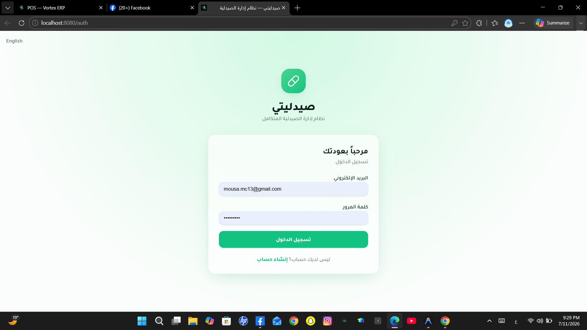](screenshots/001-pharmalove-ui.png)

<sub>Authentication — Arabic sign-in screen</sub>

### Pharmacy Operations | عمليات الصيدلية

| Point of sale | Operational workspace |
| --- | --- |
| [](screenshots/005-pharmalove-ui.png)<br><sub>Commerce — bilingual product and cart workspace</sub> | [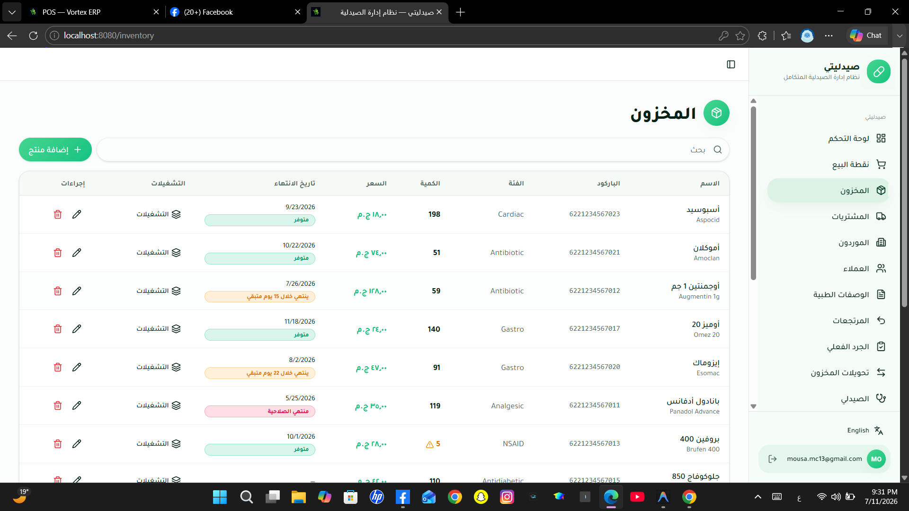](screenshots/006-pharmalove-ui.png)<br><sub>Documented pharmacy interface capture</sub> |

### Catalog and Inventory | الفهرس والمخزون

| Inventory view | Inventory detail |
| --- | --- |
| [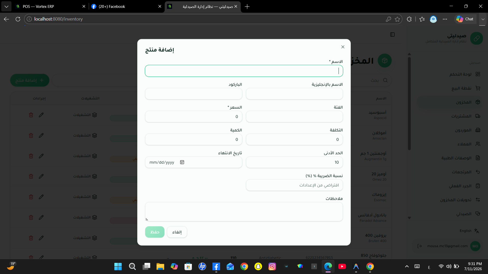](screenshots/007-pharmalove-ui.png)<br><sub>Documented catalog and inventory interface capture</sub> | [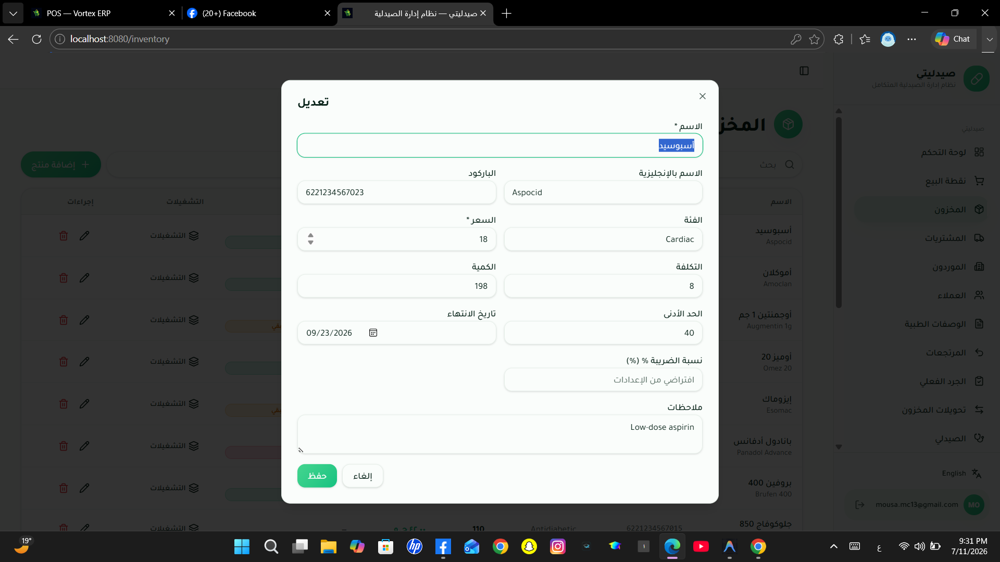](screenshots/008-pharmalove-ui.png)<br><sub>Documented inventory workflow interface capture</sub> |

### Clinical and Insight | الأدوات السريرية والرؤى

| Clinical pharmacist | Reporting and finance |
| --- | --- |
| [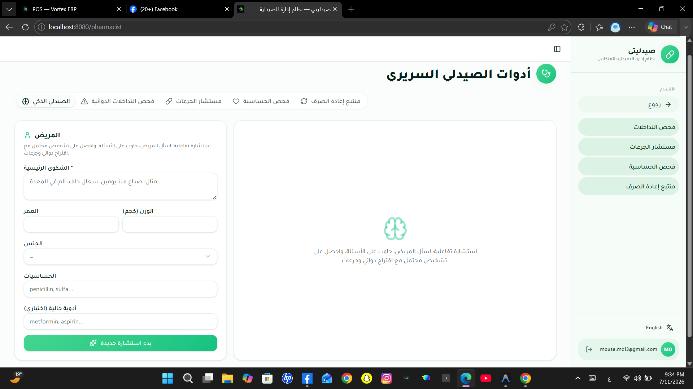](screenshots/016-pharmalove-ui.png)<br><sub>Clinical tools — guided pharmacist triage</sub> | [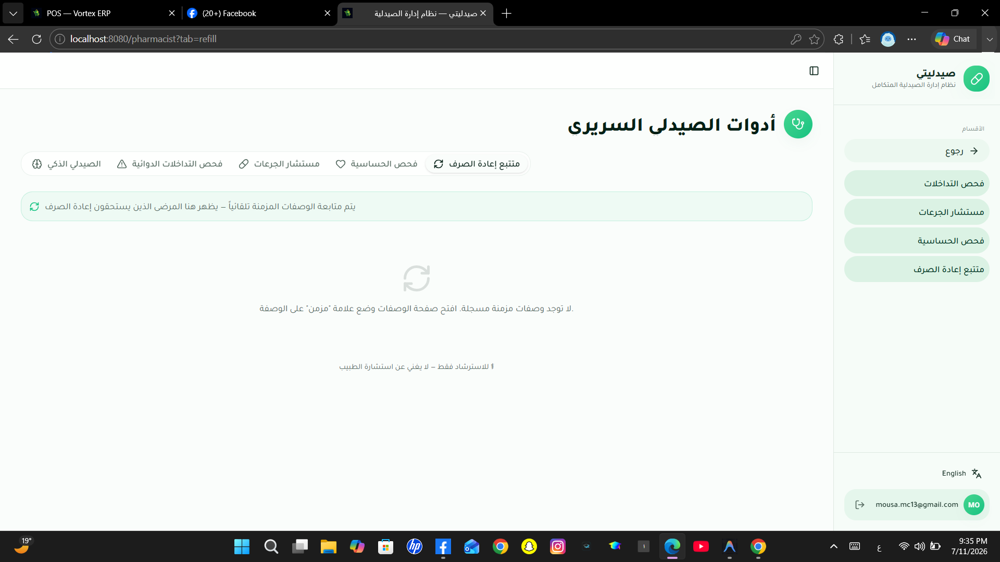](screenshots/018-pharmalove-ui.png)<br><sub>Documented reporting or finance interface capture</sub> |

### Administration | الإدارة

| Administration view | Configuration view |
| --- | --- |
| [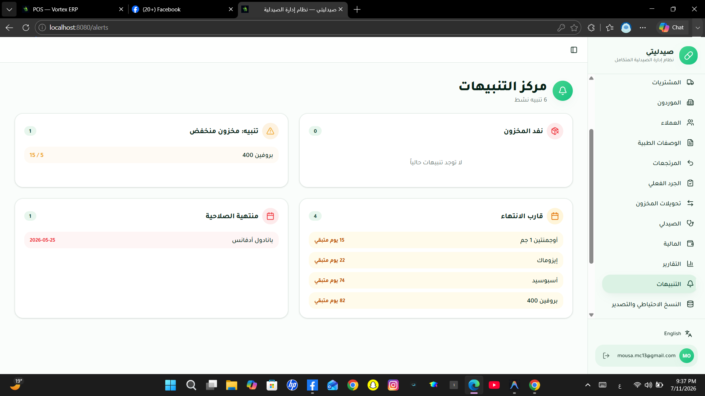](screenshots/022-pharmalove-ui.png)<br><sub>Documented administration interface capture</sub> | [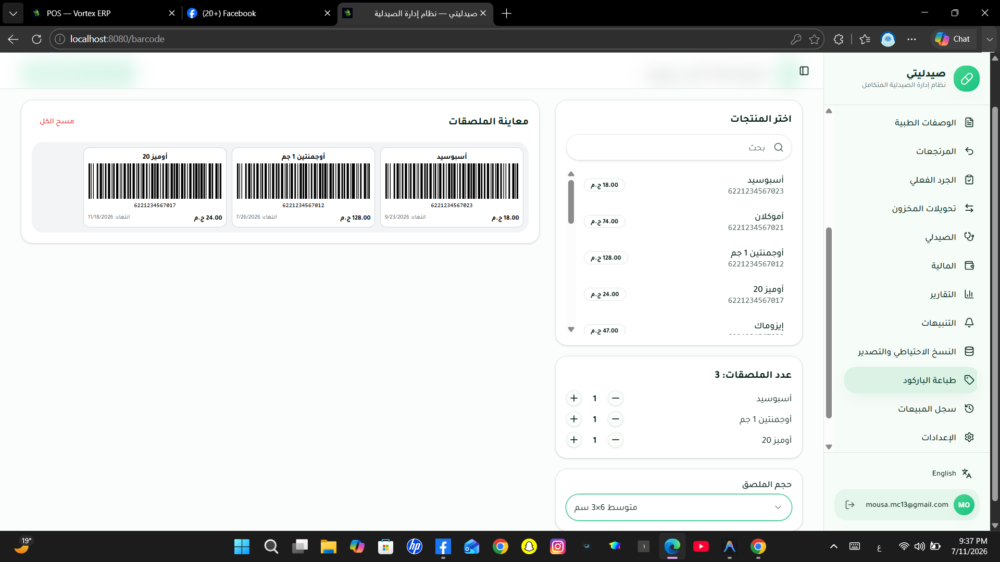](screenshots/024-pharmalove-ui.png)<br><sub>Documented configuration interface capture</sub> |

### Mobile Experience | تجربة الجوال

📸 *Screenshot: Mobile pharmacy experience — place image at: assets/screenshots/mobile-pharmacy.png*

---

## Key Features | الميزات الرئيسية

🇺🇸 **English**

- 💊 **Pharmacy POS:** searches stocked products, manages carts, accepts payment selections, writes sales and line items, and supports receipt printing.
- 📦 **Batch-aware inventory:** records product batches with manufacture/expiry dates and quantities; alerts query low stock and near-expiry products.
- 🧾 **Purchasing and supply:** creates purchase orders, tracks ordered and received quantities, and updates product quantity, cost, purchase history, and supplier balances on receipt.
- 📋 **Prescription dispensing:** stores prescriptions and medication instructions, supports review states, and can create a sale from a dispensed prescription.
- 🩺 **Clinical support:** maintains allergies and known interaction data, and exposes authenticated server functions for interaction analysis, dosage guidance, and smart triage.
- 🛡️ **Role-aware workspace:** supports admin, pharmacist, and cashier roles with Supabase authentication and database policies.
- 🌐 **Bilingual operation:** Arabic and English dictionaries switch both document language and RTL/LTR direction at runtime.

🇸🇦 **العربية**

- 💊 **نقطة بيع للصيدلية:** تبحث عن المنتجات المتاحة وتدير السلة وخيارات الدفع وتكتب المبيعات وبنودها وتدعم طباعة الإيصال.
- 📦 **مخزون واعٍ بالتشغيلات:** يسجل تشغيلات المنتجات مع تواريخ التصنيع والانتهاء والكميات؛ وتستعلم التنبيهات عن النقص وقرب انتهاء الصلاحية.
- 🧾 **المشتريات والتوريد:** ينشئ أوامر الشراء ويتابع الكميات المطلوبة والمستلمة ويحدّث كمية المنتج وتكلفته وسجل المشتريات ورصيد المورد عند الاستلام.
- 📋 **صرف الوصفات:** يحفظ الوصفات وتعليمات الدواء ويدعم حالات المراجعة ويمكنه إنشاء عملية بيع من وصفة مصروفة.
- 🩺 **دعم سريري:** يحتفظ بالحساسيات وبيانات التداخلات المعروفة ويعرض دوال خادم موثقة لتحليل التداخلات واقتراح الجرعات والفرز الذكي.
- 🛡️ **مساحة عمل تراعي الأدوار:** تدعم أدوار المدير والصيدلي وأمين الصندوق عبر مصادقة Supabase وسياسات قاعدة البيانات.
- 🌐 **تشغيل ثنائي اللغة:** تبدّل قواميس العربية والإنجليزية لغة المستند واتجاه RTL/LTR أثناء التشغيل.

## Module Overview | نظرة عامة على الوحدات

🇺🇸 **English**

The modules are organized around operational responsibilities rather than route labels.

🇸🇦 **العربية**

تُنظَّم الوحدات التالية حول المسؤوليات التشغيلية وليس حول أسماء المسارات فقط.

| Module | Purpose | Responsibilities and Main Capabilities |
| --- | --- | --- |
| Dashboard and alerts | Surface daily pharmacy signals. | Calculates summary figures and displays low-stock, expiry, and recent-sales information. |
| POS and sales | Process counter dispensing and sales. | Product search/barcode input, cart, customer and insurance selection, sales, line items, loyalty updates, and receipt printing. |
| Inventory and batches | Maintain medication availability. | Products, quantities, batch records, expiry dates, barcode labels, stock takes, warehouses, and transfers. |
| Purchases and suppliers | Manage inbound supply. | Suppliers, purchase orders and lines, receipt confirmation, product-cost/quantity updates, and supplier balances. |
| Prescriptions and clinical tools | Support pharmacist review. | Prescription items, status transitions, allergy data, interaction checking, dose advice, refill tracking, and triage UI. |
| Finance, reports, and backup | Support operational review. | Sales/purchase analysis, profit-oriented inputs, insurance claims, exports, and data backup. |
| Administration | Configure and govern the workspace. | Auth, user roles, staff, pharmacy settings, and audit-log access. |

## System Workflow | سير العمل

🇺🇸 **English**

The point-of-sale flow writes a sale and its line items, then applies product-batch and inventory updates before refreshing the affected views.

🇸🇦 **العربية**

يسجل مسار نقطة البيع عملية بيع وبنودها، ثم يطبق تحديثات تشغيلات المنتجات والمخزون قبل تحديث العروض المتأثرة.

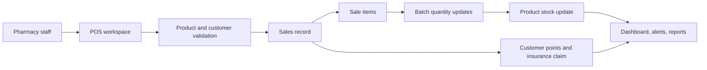

---

## Engineering Highlights | نقاط الإبداع والتميز

🇺🇸 **English**

- Clinical AI functions are implemented as authenticated TanStack Start server functions, keeping the Lovable gateway key server-side while applying Zod bounds to request data.
- The pharmacy model separates transactional headers from line items and separates product batches from product catalog records, preserving medication-level details without repeating all master data.
- Batch selection in the POS uses expiry-date ordering, and the interface labels this as FEFO (first-expiring, first-out) behavior.
- The data layer combines foreign keys, unique barcode and settings keys, role checks, row-level security, and targeted indexes for batch expiry, insurance status, and interaction lookups.

🇸🇦 **العربية**

- تُنفّذ دوال الذكاء الاصطناعي السريرية كدوال خادم موثقة في TanStack Start، مما يبقي مفتاح بوابة Lovable في الخادم مع تطبيق حدود Zod على بيانات الطلب.
- يفصل نموذج الصيدلية رؤوس المعاملات عن بنودها، ويفصل تشغيلات المنتجات عن سجلات فهرس المنتجات، للحفاظ على تفاصيل الدواء دون تكرار البيانات الأساسية.
- يستخدم اختيار التشغيلات في نقطة البيع ترتيب تاريخ الانتهاء، وتعرض الواجهة ذلك كسلوك FEFO (الأقرب انتهاءً أولاً).
- تجمع طبقة البيانات بين المفاتيح الخارجية ومفاتيح الباركود والإعدادات الفريدة وفحوص الأدوار وRow Level Security والفهارس المستهدفة لانتهاء التشغيلات وحالة التأمين والبحث عن التداخلات.

## Technology Stack

| Category | Technology | Version / Evidence |
| --- | --- | --- |
| Programming Language | TypeScript | `^5.8.3` in `package.json` |
| Database Language | SQL / PLpgSQL | Supabase migration files define schema, triggers, and functions |

### Frontend and UI

| Category | Technology | Version / Evidence |
| --- | --- | --- |
| Frontend | React | `^19.2.0` |
| Framework / Routing | TanStack Start and TanStack Router | `^1.168.26` / `^1.170.16` |
| Styling | Tailwind CSS | `^4.2.1` |
| UI Components | Radix UI, shadcn/ui configuration, CVA | Declared Radix packages and `components.json` |
| Forms | React Hook Form | `^7.71.2` |
| Icons | Lucide React | `^0.575.0` |
| Charts | Recharts | `^2.15.4` |
| Notifications | Sonner | `^2.0.7` |
| Barcode scanning | html5-qrcode | `^2.3.8` |
| Documents / export | jsPDF, jspdf-autotable, XLSX | `^4.2.1`, `^5.0.8`, `^0.18.5` |

### Backend, Database, and Authentication

| Category | Technology | Version / Evidence |
| --- | --- | --- |
| Backend | TanStack Start server functions | `createServerFn` in `src/lib/clinical.functions.ts` |
| Database | PostgreSQL through Supabase | `supabase/migrations/` and `supabase/config.toml` |
| Data Access | Supabase JavaScript client | `^2.108.2`; direct table queries and inserts |
| Authentication | Supabase Auth | Auth hook and auth middleware |
| Authorization | PostgreSQL RLS and `has_role` helper | Migration policies and role enum |
| Cloud / AI integration | Lovable AI Gateway using Gemini 2.5 Flash | Server-side gateway configuration in clinical functions |

### State, Validation, and Operations

| Category | Technology | Version / Evidence |
| --- | --- | --- |
| State Management | TanStack React Query and React state | `^5.101.1`; queries/mutations used across routes |
| Validation | Zod | `^3.24.2`; server-function input schemas |
| Localization | Custom React i18n provider | `src/i18n/index.tsx` stores Arabic/English preference |
| Printing | Browser print layouts and jsPDF utilities | `src/lib/print-receipt.ts`, `src/lib/print-prescription.ts` |
| Build Tool | Vite | `^8.0.16` |

### Build, Quality, and Delivery

| Category | Technology | Version / Evidence |
| --- | --- | --- |
| Linting | ESLint | `^9.32.0` with project configuration |
| Formatting | Prettier | `^3.7.3` |
| Browser Automation Dependency | Playwright | `^1.61.1`; no test suite/configuration is committed |
| Version Control | Git | Git repository with GitHub `origin` remote |

## Architecture Overview | نظرة عامة على المعمارية

🇺🇸 **English**

The repository is a modular, file-routed TanStack Start application. Browser routes use React Query with the Supabase client for authenticated data access; clinical capabilities use protected server functions because they require a server-only gateway key. This split fits the project’s interactive dashboard screens while isolating sensitive AI credentials from the browser.

🇸🇦 **العربية**

المستودع تطبيق TanStack Start معياري يعتمد على المسارات المبنية من الملفات. تستخدم مسارات المتصفح React Query مع عميل Supabase للوصول الموثق إلى البيانات؛ بينما تستخدم القدرات السريرية دوال خادم محمية لأنها تتطلب مفتاح بوابة خاصاً بالخادم. يناسب هذا الفصل شاشات لوحة المتابعة التفاعلية ويعزل بيانات اعتماد الذكاء الاصطناعي الحساسة عن المتصفح.

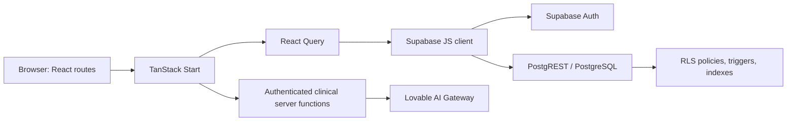

## Engineering Decisions | القرارات الهندسية

🇺🇸 **English**

The choices below are grounded in the repository’s code and schema.

🇸🇦 **العربية**

تعتمد القرارات التالية على شيفرة المستودع ومخطط قاعدة البيانات.

| Decision | Repository Evidence | Engineering Rationale |
| --- | --- | --- |
| Use Supabase directly rather than an ORM | Queries use `supabase.from(...)`; generated database types are present. | Keeps typed browser data access close to the managed Auth/PostgreSQL platform used by the application. |
| Isolate clinical AI calls on the server | `clinical.functions.ts` calls the gateway with `LOVABLE_API_KEY`; functions use auth middleware. | Prevents exposing the gateway credential in browser code and makes authenticated validation possible at the boundary. |
| Model sales, purchases, prescriptions, returns, and orders as headers plus items | Separate `sales`/`sale_items`, `prescriptions`/`prescription_items`, and analogous migration tables. | Allows one transaction to contain multiple products while retaining transaction-level totals, status, and relationship fields. |
| Keep batches separate from products | `product_batches` references `products` and carries dates, quantity, cost, and optional warehouse. | A single medicine can have multiple batches with different expiry and cost details. |
| Use runtime RTL/LTR switching | I18n provider writes `document.documentElement.lang` and `dir`. | Supports Arabic and English operational use without maintaining separate page implementations. |

## Performance Considerations | اعتبارات الأداء

🇺🇸 **English**

The repository contains these explicit measures; performance characteristics beyond them are not documented.

🇸🇦 **العربية**

يتضمن المستودع الإجراءات الصريحة التالية؛ ولا توثّق خصائص أداء إضافية تتجاوزها.

| Evidence | Implementation Detail | Practical Effect / Boundary |
| --- | --- | --- |
| React Query usage | Route-level `useQuery`, `useMutation`, and query-client invalidation are used. | Keeps asynchronous screen state coordinated after writes; cache configuration is not centrally documented. |
| Bounded reads | POS products use `.limit(40)`, customers `.limit(200)`, generic CRUD `.limit(100)`, and several views restrict result sets. | Avoids unbounded payloads on common screens; not every route uses pagination. |
| Targeted indexes | Migrations index product-batch product/expiry, interaction lowercased drug pairs, and insurance claim status/sale. | Supports the corresponding relationship, expiry, interaction, and claim lookup paths. |
| Parallel dashboard query | Dashboard retrieves several independent values with `Promise.all`. | Reduces waiting time compared with serial client requests for that view. |
| FEFO batch order | POS queries batches ordered by expiry date before reducing quantities. | Supports earliest-expiry selection; concurrency control for multi-user stock writes is not documented. |

## Technical Challenges | التحديات التقنية

🇺🇸 **English**

- **Dispensing across stock and batches:** a sale affects several records. The POS writes a sale and items, adjusts batch quantities ordered by expiry, then updates product quantity.
- **Prescription-to-sale continuity:** prescription items, dispensing status, and an optional sale relationship maintain a link between clinical review and counter activity.
- **Clinical guidance boundary:** interaction, dosage, and triage capabilities require contextual input. Auth middleware and Zod schemas restrict server-function access and bound submitted fields; the UI labels clinical guidance as not a substitute for a physician.
- **Arabic/English operational use:** the i18n provider updates both text selection and document direction, avoiding a static one-direction interface.
- **Access governance:** the database enables RLS across business tables, gives profile data owner-specific policies, limits audit-log reads to admins, and protects settings writes with the admin role helper.

🇸🇦 **العربية**

- **الصرف عبر المخزون والتشغيلات:** تؤثر عملية البيع في عدة سجلات. تكتب نقطة البيع عملية بيع وبنودها، وتعدل كميات التشغيلات مرتبة حسب الانتهاء، ثم تحدث كمية المنتج.
- **استمرارية الوصفة إلى البيع:** تحافظ بنود الوصفة وحالة الصرف وعلاقة البيع الاختيارية على صلة بين المراجعة السريرية ونشاط الكاونتر.
- **حدود الإرشاد السريري:** تحتاج قدرات التداخلات والجرعات والفرز إلى مدخلات سياقية. تقيد مصادقة الوسيط ومخططات Zod الوصول إلى دوال الخادم وتضبط الحقول المرسلة؛ وتوضح الواجهة أن الإرشاد السريري ليس بديلاً للطبيب.
- **التشغيل بالعربية والإنجليزية:** يحدّث مزود i18n اختيار النص واتجاه المستند معاً، متجنباً واجهة ثابتة باتجاه واحد.
- **حوكمة الوصول:** تفعّل قاعدة البيانات RLS على جداول الأعمال، وتمنح بيانات الملف الشخصي سياسات خاصة بالمالك، وتقصر قراءة سجل التدقيق على المديرين، وتحمي كتابة الإعدادات بدالة دور المدير.

## UI/UX Design

| Element | Tool / Library |
| --- | --- |
| Component system | Radix UI primitives with shadcn/ui configuration |
| Styling and color implementation | Tailwind CSS and CSS variables in project styles |
| Icons | Lucide React |
| Charts | Recharts |
| Form controls | React Hook Form and Radix-based components |
| Feedback | Sonner toast notifications, alerts, dialogs, and progress components |
| Responsive behavior | `use-mobile` hook and responsive UI components |
| Localization | Custom Arabic/English translations with RTL/LTR document direction |
| Theme | Theme preference is not evidenced as a persisted feature in the inspected source |

## Installation & Configuration

1. Clone the canonical repository remote detected from Git.

```bash
git clone https://github.com/mosaa65/PharmaHub-suite.git
cd PharmaHub-suite
```

2. Install dependencies.

```bash
npm install
```

3. Create a local `.env` file. The application reads the following names from the client/server Supabase integrations. `SUPABASE_SERVICE_ROLE_KEY` is server-only; do not expose it to browser code.

```bash
VITE_SUPABASE_URL=your_supabase_project_url
VITE_SUPABASE_PUBLISHABLE_KEY=your_supabase_publishable_key
SUPABASE_URL=your_supabase_project_url
SUPABASE_PUBLISHABLE_KEY=your_supabase_publishable_key
SUPABASE_SERVICE_ROLE_KEY=your_server_only_service_role_key
LOVABLE_API_KEY=your_lovable_ai_gateway_key
```

4. Apply the SQL migrations in `supabase/migrations/` to the configured Supabase PostgreSQL project. For demo data, the repository provides `supabase/manual_seed.sql`, intended to be run in the Supabase SQL Editor when CLI seeding credentials are unavailable.

5. Start the development server.

```bash
npm run dev
```

6. Run quality/build commands as needed.

```bash
npm run lint
npm run build
npm run preview
```

## Project Structure

```text
pharmalove-suite/
├── public/                 # Favicon and Inama Soft logo
├── screenshots/            # Verified UI captures and index
├── scripts/                # Showcase and browser automation utilities
├── src/
│   ├── components/         # App shell, CRUD, and UI components
│   ├── hooks/              # Authentication and mobile hooks
│   ├── i18n/               # Arabic/English provider and dictionaries
│   ├── integrations/       # Supabase clients, types, and middleware
│   ├── lib/                # Clinical functions, printing, export, utilities
│   └── routes/             # File-based public and authenticated routes
├── supabase/
│   ├── migrations/         # PostgreSQL schema, RLS, indexes, and triggers
│   └── manual_seed.sql     # Manual demo-data script
├── package.json
└── vite.config.ts
```

## Services Provided

| Service | Short Description |
| --- | --- |
| Pharmacy counter operations | Supports product selection, customer-linked checkout, receipts, returns, and sale history. |
| Medication inventory control | Tracks product stock, batches, expiry information, barcode labels, stock takes, and transfers. |
| Supplier and purchasing administration | Supports supplier records, purchase orders, receiving, and balance tracking. |
| Prescription and clinical support | Maintains prescriptions, allergy data, interaction lookup, dosing assistance, and triage workflows. |
| Pharmacy oversight | Provides alerts, finance/reporting views, insurance claim records, export, and backup capabilities. |

## API Overview

> This repository does not expose an application-owned REST or GraphQL API. Browser data access uses the Supabase client against the project’s Supabase boundary; clinical features use TanStack Start server functions.

| Area | Integration / Mechanism | Responsibility |
| --- | --- | --- |
| Authentication | Supabase Auth client and server middleware | Sign-up/sign-in/session handling and protected server-function context. |
| Pharmacy data | Supabase JavaScript client / PostgREST boundary | Typed reads and writes for products, sales, purchases, prescriptions, suppliers, and related data. |
| Clinical interaction analysis | `analyzeInteractions` server function | Combines authenticated database interaction lookup with optional AI response. |
| Dose guidance | `recommendDosage` server function | Sends validated clinical context to the server-side AI gateway. |
| Guided triage | `smartTriage` server function | Validates bounded consultation input and returns structured AI-assisted guidance. |

## Database Overview | نظرة عامة على قاعدة البيانات

🇺🇸 **English**

PharmaLove Suite uses PostgreSQL through Supabase. The schema separates identity and roles, product master data and batches, transaction headers and items, clinical records, and operational controls. Foreign keys link the core relationships; unique constraints protect user-role combinations, product barcodes, and settings keys. Indexed paths include batch expiry, interaction drug pairs, and insurance-claim status/sale lookup. Most business tables enable Row Level Security; many operational-table policies currently permit all authenticated users, while profile, audit, and settings policies are more specific.

🇸🇦 **العربية**

يستخدم PharmaLove Suite PostgreSQL عبر Supabase. يفصل المخطط بين الهوية والأدوار، والبيانات الأساسية للمنتجات والتشغيلات، ورؤوس المعاملات وبنودها، والسجلات السريرية، والضوابط التشغيلية. تربط المفاتيح الخارجية العلاقات الأساسية؛ وتحمي القيود الفريدة تركيبات المستخدم/الدور وباركود المنتج ومفاتيح الإعدادات. تشمل المسارات المفهرسة انتهاء التشغيلات وأزواج أدوية التداخلات وحالة/بيع مطالبة التأمين. تفعّل معظم جداول الأعمال Row Level Security؛ وتسمح سياسات كثيرة للجداول التشغيلية حالياً لجميع المستخدمين الموثقين، بينما تكون سياسات الملف الشخصي وسجل التدقيق والإعدادات أكثر تحديداً.

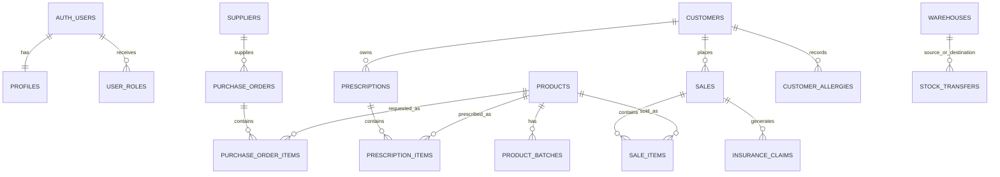

## Security | الأمان

🇺🇸 **English**

- **Authentication:** Supabase Auth provides account and session handling; protected route layout and server middleware require an authenticated user.
- **Roles:** the `app_role` enum defines `admin`, `pharmacist`, and `cashier`; `has_role` is a security-definer helper used by relevant policies.
- **Row Level Security:** migrations enable RLS on identity, operations, clinical, and settings tables. Profile access is scoped to the owner, audit-log reads require admin, and settings writes require admin.
- **Input validation:** clinical server functions use Zod to validate and bound drug lists, demographic fields, conversation length, and input text.
- **Secret isolation:** client code uses a publishable Supabase key; the service-role client and `LOVABLE_API_KEY` are read from server environment variables.
- **Data integrity:** foreign keys, unique keys, triggers for profile and invoice creation, and selected indexes are declared in migrations.

🇸🇦 **العربية**

- **المصادقة:** توفر Supabase Auth إدارة الحسابات والجلسات؛ ويتطلب تخطيط المسارات المحمي ووسيط الخادم مستخدماً موثقاً.
- **الأدوار:** يعرّف تعداد `app_role` أدوار `admin` و`pharmacist` و`cashier`؛ ودالة `has_role` هي دالة security-definer تستخدمها السياسات ذات الصلة.
- **أمن مستوى الصف:** تفعّل الترحيلات RLS على جداول الهوية والعمليات والبيانات السريرية والإعدادات. يقتصر وصول الملف الشخصي على مالكه، وتتطلب قراءة سجل التدقيق دور المدير، وتتطلب كتابة الإعدادات دور المدير.
- **التحقق من المدخلات:** تستخدم دوال الخادم السريرية Zod للتحقق من قوائم الأدوية والبيانات الديموغرافية وطول المحادثة والنصوص وضبط حدودها.
- **عزل الأسرار:** تستخدم شيفرة العميل مفتاح Supabase قابل للنشر؛ بينما يقرأ عميل service-role ومفتاح `LOVABLE_API_KEY` من متغيرات بيئة الخادم.
- **سلامة البيانات:** تعرّف الترحيلات مفاتيح خارجية ومفاتيح فريدة ومحفزات لإنشاء الملف الشخصي ورقم الفاتورة وفهارس مختارة.

## Deployment | النشر

🇺🇸 **English**

**Live URL:** `[PROJECT_LIVE_URL — not specified in repository]`

Deploy a production build after configuring the Supabase variables listed in [Installation & Configuration](#installation--configuration--التثبيت-والإعداد). The repository’s Vite configuration delegates the TanStack Start build configuration to `@lovable.dev/vite-tanstack-config` and specifies `src/server.ts` as the server entry.

```bash
npm run build
npm run preview
```

🇸🇦 **العربية**

**الرابط المباشر:** `[PROJECT_LIVE_URL — غير محدد في المستودع]`

انشر نسخة الإنتاج بعد ضبط متغيرات Supabase الموضحة في [التثبيت والإعداد](#installation--configuration--التثبيت-والإعداد). يفوض إعداد Vite في المستودع إعداد بناء TanStack Start إلى `@lovable.dev/vite-tanstack-config` ويحدد `src/server.ts` كنقطة دخول للخادم.

## Roadmap | خارطة الطريق

🇺🇸 **English**

No product roadmap is documented in the repository.

`[Add evidence-backed product roadmap items for PharmaLove Suite]`

🇸🇦 **العربية**

لا توجد خارطة طريق للمنتج موثقة في المستودع.

`[أضف عناصر خارطة طريق للمنتج مدعومة بأدلة لـ PharmaLove Suite]`

## Development Team

| Name | Responsibilities |
| --- | --- |
| **المهندس موسى** (Mousa Gamil Al-Awadhi) | Technical Leadership, System Architecture, Backend Engineering, Frontend Engineering, Database Design, Documentation |

---

<div align="center">


**Made with ❤️ by Inama Soft — Collaborative Development Group**

Mousa Gamil Al-Awadhi

Ibb, Yemen · [mousa.mc13@gmail.com](mailto:mousa.mc13@gmail.com) · [+967 772 217 218](tel:+967772217218)

[Website](https://inma-soft.vercel.app) · [LinkedIn](https://www.linkedin.com/in/mousa-al-awadhi-6518633a8) · [GitHub](https://github.com/mosaa65) · [Live Project](pharma-hub-suite.vercel.app)

تم التطوير بواسطة فريق Inama Soft © 2026

</div>
